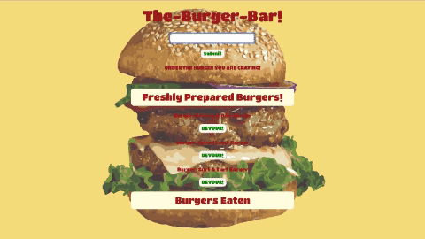

# sequelizedBurger

[Sequelized-Burger-Bar](https://hidden-hollows-63563.herokuapp.com/) is a Burger Ordering App using Node.js and Express Web Frameworks, Handlebars and Sequelize ORM. Users can custom order their individual burgers in the input field along with their names and then "eat it". The App logs all burgers ordered and eaten. It uses Sequelize and MySQL2 to query and route data to the App and Handlebars to generate the HTML. 
 

## Getting Started

- Clone Repo
- Run command in Terminal "npm install"
- Run command "npm start"
- Run "ctrl + c" to exit mode

## Technologies Utilized

- CSS3
    - Bootstrap 4.2.1
- JavaScript
    - Node.js
        - Express
        - Body-Parser
        - Express-Handlebars
        - Morgan
        - Nodemon
- Database
    - MySQL2
- Testing
    - Eslint
- Deployment
    - Heroku
       

## Author

- Susye Weng-Reeder - *JavaScript/ Node.js/ Express/ MySQL/ Sequelize/ Heroku* - [Susye Weng-Reeder](https://www.weng-reeder.com/ "Susye's Portfolio")
